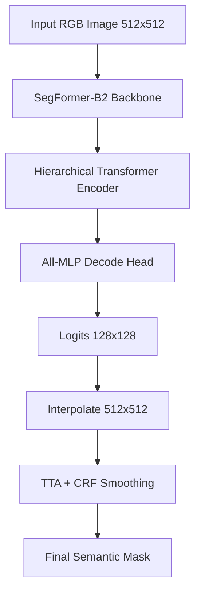

# OffRoad Scene Segmentation - Duality Hackathon

[](https://www.python.org/)
[](https://pytorch.org/)
[](https://huggingface.co/docs/transformers/index)

> State-of-the-art semantic segmentation of off-road terrain using a fine-tuned SegFormer-B2 transformer. Features two-stage training, Test-Time Augmentation (TTA), and CRF-based post-processing for sharpened spatial boundaries.

---

### Quick Links
- **[Main Implementation Notebook](notebooks/main_implementation.ipynb)** - Cleaned and structured for presentation
- **[Project Assets (Drive)](https://drive.google.com/drive/folders/16_LIy5N4i8Z7vOtLKY8HVT3izpA6StNK)** - PPT, Pitch Video, Demo Video, and Assessment Answers

---

## Project Description

Off-road autonomous navigation requires a robust understanding of unstructured terrain - distinguishing dirt trails from rocks, grass, sky, and obstacles. This project tackles the Duality Hackathon's Off-Road Segmentation Challenge, producing pixel-level semantic maps across 6 terrain classes from RGB drone/camera images.

### Methodology
The approach uses a two-stage training strategy:
1. Stage 1 (Backbone Frozen): Only the decode head is trained to stabilize early learning.
2. Stage 2 (Full Fine-Tuning): End-to-end training with a lower learning rate, combined Loss (CE + Dice), label smoothing, and mixed-precision training.

Post-Processing: At inference, we apply Test-Time Augmentation (TTA) with multi-scale averaging and CRF smoothing to sharpen spatial boundaries.

---

## Repository Structure

```
.
├── notebooks/
│   ├── main_implementation.ipynb       # Main cleaned notebook
│   ├── optimized_training.ipynb        # Optimized training experiment
│   ├── baseline_training.ipynb         # Baseline model training
│   └── deprecated_v1.ipynb             # Initial version 1
├── scripts/
│   ├── train_model.py                  # Main training script
│   ├── test_segmentation.py            # Model testing script
│   └── main_implementation.py          # Python version of main notebook
├── src/
│   ├── dataset.py                      # Custom Dataset class
│   ├── config.py                       # Configuration parameters
│   └── (other core modules)
├── models/                             # Saved model weights (.pth)
├── requirements.txt
└── README.md
```

---

## Technical Stack

| Category | Technology |
|---|---|
| Core Framework | PyTorch, Python 3 |
| Model Architecture | SegformerForSemanticSegmentation (nvidia/segformer-b2) |
| Augmentations | Albumentations v2.0+ |
| Metrics | torchmetrics.MulticlassJaccardIndex (mIoU) |
| Post-Processing | pydensecrf (CRF smoothing) |
| Environment | Kaggle T4 GPU |

### Results
The final model achieves an mIoU of 0.5155 across the 5 test-set classes.

| Class Label | IoU Score |
|---|---|
| Dirt/Trail | 0.4961 |
| Sky | 0.9819 |
| Obstacle | 0.6165 |
| Background | 0.4249 |
| Rock | 0.0582 |

---

## Architecture Overview



---

## Dataset Structure

- Training set: RGB images + RGB-encoded semantic masks.
- Mask encoding: Original labels {0, 1, 2, 3, 27, 39} remapped to {0, 1, 2, 3, 4, 5} for 6 distinct terrain classes.

| ID | Label | Description |
|---|---|---|
| 0 | Background | Undefined / Unlabeled |
| 1 | Dirt/Trail | Traversable off-road paths |
| 2 | Grass/Veg | Vegetation |
| 3 | Rock | Rocky terrain |
| 4 | Sky | Open sky regions |
| 5 | Obstacle | Non-traversable obstacles |

---

## Getting Started

### 1. Installation
```bash
pip install torch torchvision transformers timm segmentation-models-pytorch albumentations torchmetrics pydensecrf opencv-python matplotlib seaborn tqdm scikit-learn
```

### 2. Training
```bash
# Using the main script
python scripts/train_model.py
```

### 3. Inference
```bash
# Example inference call
python scripts/test_segmentation.py --checkpoint models/best_model.pth
```

---

## License
This project was developed for the Duality Hackathon. Dataset copyright belongs to Duality AI.
